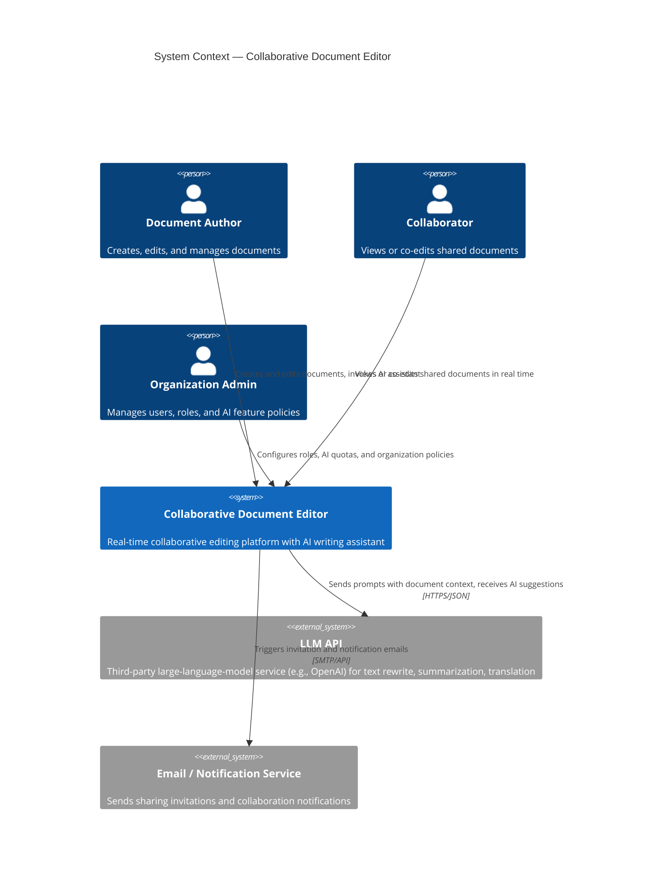
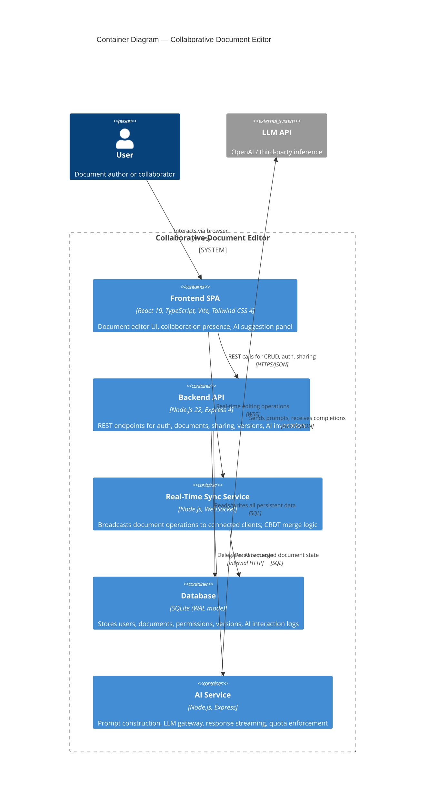
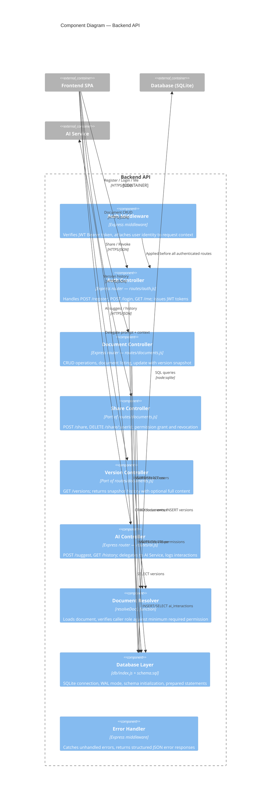

# C4 Architecture Diagrams

All diagrams use Mermaid and follow the [C4 model](https://c4model.com). Rendered PNGs are generated from these source blocks via the [Mermaid Live Editor](https://mermaid.live).

---

## Level 1 — System Context Diagram

Shows the Collaborative Editor as a single box and its relationships with external actors.

**Explanation.** The system serves three actor categories. Document Authors are the primary users who create content and invoke AI features. Collaborators participate via shared access at varying permission levels. Organization Admins govern policies such as role assignments and AI usage quotas. The system depends on two external services: a third-party LLM API for AI writing features, and an email/notification service for sharing workflows. All external communication flows over encrypted channels.

---

## Level 2 — Container Diagram

Zooms into the system to show the major deployable containers, their technology choices, and inter-container communication.

**Explanation.** The system decomposes into five containers:

| Container | Responsibility | Technology |
|-----------|---------------|------------|
| **Frontend SPA** | Editor UI, collaboration presence indicators, AI suggestion display and accept/reject flow | React 19, TypeScript, Vite, Tailwind CSS 4 |
| **Backend API** | Authentication (JWT + bcrypt), document CRUD, permission management, version snapshots, AI request routing | Node.js 22, Express 4 |
| **Real-Time Sync Service** | WebSocket connection management, operation broadcast, CRDT merge, presence tracking | Node.js, WebSocket |
| **Database** | Persistent storage for users, documents, permissions, versions, AI interaction logs | SQLite in WAL mode |
| **AI Service** | Prompt construction from document context, LLM API gateway, response streaming, usage metering | Node.js, Express |

The Frontend SPA maintains two connections to the backend: a standard HTTPS channel for REST operations and a persistent WebSocket for real-time sync. The AI Service is separated from the main API so that prompt logic, model routing, and cost controls can evolve independently. For the PoC milestone, the Sync Service and AI Service are logical modules within the single Express backend; they will be extracted into separate deployable containers when traffic warrants it.

---

## Level 3 — Component Diagram (Backend API)

Zooms into the Backend API container to show its internal components.

**Explanation.** The Backend API contains the following components:

| Component | File(s) | Responsibility |
|-----------|---------|---------------|
| **Auth Middleware** | `middleware/auth.js` | Extracts and verifies the JWT from the `Authorization` header; attaches `req.user = { id, email }` |
| **Auth Controller** | `routes/auth.js` | Registration (bcrypt hash + INSERT), login (bcrypt compare + JWT sign), session restore (`GET /me`) |
| **Document Controller** | `routes/documents.js` | List owned + shared documents, create, read (with collaborators), update (with version snapshot), delete |
| **Share Controller** | `routes/documents.js` | Grant access by email + role, revoke access by user ID; enforces owner-only policy |
| **Version Controller** | `routes/documents.js` | Returns version history ordered by recency; supports `?full=1` for content inclusion |
| **AI Controller** | `routes/ai.js` | Accepts prompt + optional context, logs the interaction, delegates to the AI Service, returns suggestion |
| **Document Resolver** | `resolveDoc()` in `routes/documents.js` | Central authorization gate: loads document, checks owner or permission role against the required minimum |
| **Database Layer** | `db/index.js`, `schema.sql` | Opens SQLite in WAL mode, runs schema migration, exposes synchronous prepared-statement API |
| **Error Handler** | `app.js` | Catches uncaught Express errors and returns `{ error: "Internal server error" }` with status 500 |

The Document Resolver (`resolveDoc`) is the single point of authorization for all document-scoped operations. This avoids scattering permission checks across multiple route handlers and ensures consistent 403/404 responses.
